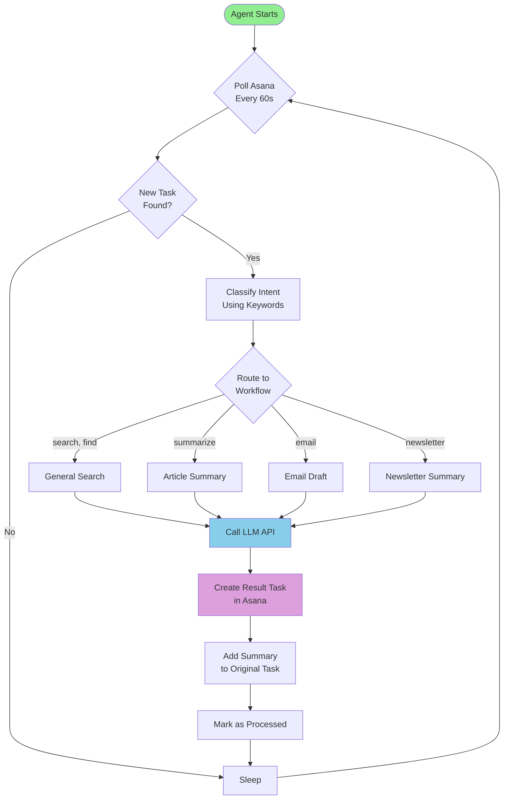

# Asana AI Agent Monitor


An intelligent AI agent that monitors Asana tasks and automatically executes workflows using multiple LLM providers (Gemini, Claude, OpenAI, Perplexity). Perfect for automating research, summarization, email drafting, and general search tasks directly from your Asana workspace.

## 🎯 What It Does

The Asana AI Agent runs as a background daemon, continuously monitoring your Asana project for new tasks. When it detects tasks matching specific keywords, it automatically:

- 🔍 **Performs web research** for shopping, product recommendations, or general queries
- 📄 **Summarizes articles** from URLs in task descriptions
- ✉️ **Drafts emails** based on task requirements
- 📰 **Processes newsletters** to extract key insights
- 🔗 **Opens URLs** and reports findings

Results are delivered as new Asana tasks assigned to you, with brief summaries added as comments to the original task.

## 🚀 Quick Start (5 Minutes)

### Prerequisites

- Ruby 3.0 or higher
- An Asana account with API access
- At least one AI provider API key (Gemini, Claude, OpenAI, or Perplexity)

### Installation

1. **Clone the repository:**
```bash
git clone https://github.com/ttunguz/asana-ai-agent.git
cd asana-ai-agent
```

2. **Install dependencies:**
```bash
bundle install
```

3. **Configure the agent:**
```bash
cp config/config.example.yml config/config.yml
```

4. **Edit `config/config.yml`** with your API keys and Asana project details:

```yaml
asana:
  api_key: ${ASANA_API_KEY}              # Get from https://app.asana.com/0/my-apps
  workspace_gid: "1234567890"            # Found in Asana workspace URL
  project_gid: "9876543210"              # Found in your project URL
  users:
    tom: "1111111111"                    # Your Asana user GID

ai:
  gemini:
    enabled: true
    api_key: ${GEMINI_API_KEY}           # Get from https://ai.google.dev
  claude:
    enabled: false
    api_key: ${ANTHROPIC_API_KEY}        # Optional: https://console.anthropic.com
  openai:
    enabled: false
    api_key: ${OPENAI_API_KEY}           # Optional: https://platform.openai.com
```

5. **Set environment variables** (recommended for security):
```bash
export ASANA_API_KEY="your_asana_key"
export GEMINI_API_KEY="your_gemini_key"
```

6. **Run the agent:**
```bash
ruby bin/asana_agent
```

That's it! The agent is now monitoring your Asana project.

## 📊 How It Works



### Workflow Examples

#### Example 1: General Search

**You create a task:**
```
Title: Search for the best wireless headphones under $200
Notes: I need over-ear headphones with noise cancellation
```

**Agent automatically:**
1. Detects keyword "search"
2. Extracts query from task notes
3. Calls configured LLM (e.g., Perplexity for web search)
4. Creates a new task for you with detailed recommendations
5. Adds a brief summary comment to the original task

**Result task contains:**
- Product recommendations with prices
- Key features comparison
- Links to purchase
- Source citations

#### Example 2: Article Summary

**You create a task:**
```
Title: Summarize this article
Notes: https://example.com/long-article-about-ai
```

**Agent automatically:**
1. Detects keyword "summarize"
2. Fetches article content from URL
3. Sends to LLM for summarization
4. Creates result task with structured summary
5. Adds comment to original task

## 🔧 Configuration

### Asana Settings

```yaml
asana:
  api_key: ${ASANA_API_KEY}              # Your Asana personal access token
  workspace_gid: "1234567890"            # Workspace ID from URL
  project_gid: "9876543210"              # Project ID to monitor
  users:                                 # Map usernames to Asana GIDs
    tom: "1111111111"
    sarah: "2222222222"
```

**Finding your IDs:**
- **Workspace GID**: Open Asana → Settings → Your workspace URL contains the GID
- **Project GID**: Open your project → URL contains the project GID
- **User GID**: Click on your profile → Settings → Copy user ID from URL

### AI Provider Configuration

Enable one or more AI providers:

```yaml
ai:
  gemini:
    enabled: true                        # Google Gemini (recommended for cost)
    api_key: ${GEMINI_API_KEY}
    model: gemini-2.0-flash-exp          # Fast & affordable
    temperature: 0.7
    max_tokens: 8192

  claude:
    enabled: true                        # Anthropic Claude (best quality)
    api_key: ${ANTHROPIC_API_KEY}
    model: claude-3-5-sonnet-20241022
    temperature: 0.7
    max_tokens: 8192

  openai:
    enabled: false                       # OpenAI GPT (balanced)
    api_key: ${OPENAI_API_KEY}
    model: gpt-4
    temperature: 0.7
    max_tokens: 4096

  perplexity:
    enabled: false                       # Perplexity (excellent for search)
    api_key: ${PERPLEXITY_API_KEY}
    model: llama-3.1-sonar-large-128k-online
    temperature: 0.7
    max_tokens: 4096
```

**Provider Selection:**
- The agent uses the **first enabled provider** in order (Gemini → Claude → OpenAI → Perplexity)
- If the primary provider fails, it automatically tries the next enabled provider
- **Recommendation**: Enable multiple providers for redundancy

### Agent Behavior

```yaml
agent:
  poll_interval: 60                      # Check for new tasks every 60 seconds
  max_tasks_per_cycle: 10                # Process at most 10 tasks per cycle
  comment_monitoring: true               # Monitor comments for new requests
```

### Workflow Keywords

Customize keywords that trigger each workflow:

```yaml
workflows:
  keywords:
    general_search:
      - search for
      - find me
      - shopping
      - buy
      - recommend
      - suggest
      - looking for
      - best

    article_summary:
      - summarize
      - summary
      - read

    email_draft:
      - email
      - draft email
      - message
      - write to

    newsletter_summary:
      - newsletter
      - newsletters
      - newsletter digest
      - news summary
```

## 🛠️ Advanced Usage

### Running as a Daemon

#### macOS (launchd)

Create `~/Library/LaunchAgents/com.asana-agent.plist`:

```xml
<?xml version="1.0" encoding="UTF-8"?>
<!DOCTYPE plist PUBLIC "-//Apple//DTD PLIST 1.0//EN" "http://www.apple.com/DTDs/PropertyList-1.0.dtd">
<plist version="1.0">
<dict>
    <key>Label</key>
    <string>com.asana-agent</string>
    <key>ProgramArguments</key>
    <array>
        <string>/usr/bin/ruby</string>
        <string>/path/to/asana-ai-agent/bin/asana_agent</string>
    </array>
    <key>RunAtLoad</key>
    <true/>
    <key>KeepAlive</key>
    <true/>
    <key>StandardOutPath</key>
    <string>/tmp/asana-agent.log</string>
    <key>StandardErrorPath</key>
    <string>/tmp/asana-agent.error.log</string>
    <key>EnvironmentVariables</key>
    <dict>
        <key>ASANA_API_KEY</key>
        <string>your_key_here</string>
        <key>GEMINI_API_KEY</key>
        <string>your_key_here</string>
    </dict>
</dict>
</plist>
```

Load and start:
```bash
launchctl load ~/Library/LaunchAgents/com.asana-agent.plist
launchctl start com.asana-agent
```

#### Linux (systemd)

Create `/etc/systemd/system/asana-agent.service`:

```ini
[Unit]
Description=Asana AI Agent Monitor
After=network.target

[Service]
Type=simple
User=your_username
WorkingDirectory=/path/to/asana-ai-agent
ExecStart=/usr/bin/ruby /path/to/asana-ai-agent/bin/asana_agent
Restart=always
Environment="ASANA_API_KEY=your_key"
Environment="GEMINI_API_KEY=your_key"

[Install]
WantedBy=multi-user.target
```

Enable and start:
```bash
sudo systemctl enable asana-agent
sudo systemctl start asana-agent
sudo systemctl status asana-agent
```

### Docker Deployment

```dockerfile
FROM ruby:3.2-alpine

RUN apk add --no-cache build-base

WORKDIR /app
COPY Gemfile Gemfile.lock ./
RUN bundle install

COPY . .

CMD ["ruby", "bin/asana_agent"]
```

Build and run:
```bash
docker build -t asana-agent .
docker run -d \
  -e ASANA_API_KEY=your_key \
  -e GEMINI_API_KEY=your_key \
  -v $(pwd)/config:/app/config \
  --name asana-agent \
  asana-agent
```

## 🔌 Extending the Agent

### Adding a New Workflow

1. **Create workflow file** in `lib/workflows/my_workflow.rb`:

```ruby
module Workflows
  class MyWorkflow < Base
    def execute
      # Extract data from task
      query = extract_query_from_task

      # Call LLM
      response = call_llm(query)

      # Create result task
      create_result_task(
        title: "Results: #{@task.name}",
        notes: response
      )

      # Add comment to original task
      add_comment_to_task("✅ Workflow completed. See results task.")
    end

    private

    def extract_query_from_task
      @task.notes || @task.name
    end
  end
end
```

2. **Add keywords** to `config.yml`:

```yaml
workflows:
  keywords:
    my_workflow:
      - keyword1
      - keyword2
```

3. **Update router** in `lib/workflows/gemini_code.rb`:

```ruby
if matches_keywords?(combined_text, keywords['my_workflow'])
  Workflows::MyWorkflow.new(@task, all_comments: @all_comments)
else
  # existing routing logic
end
```

### Adding a New LLM Provider

1. **Create client** in `lib/llm/myprovider_client.rb`:

```ruby
module LLM
  class MyProviderClient < ClientBase
    BASE_URL = "https://api.myprovider.com/v1"

    def generate(prompt, options = {})
      response = make_request(
        "#{BASE_URL}/chat",
        {
          messages: [{ role: "user", content: prompt }],
          model: @model,
          temperature: @temperature,
          max_tokens: @max_tokens
        }
      )

      {
        response: response["choices"][0]["message"]["content"],
        tokens: {
          prompt: response["usage"]["prompt_tokens"],
          completion: response["usage"]["completion_tokens"],
          total: response["usage"]["total_tokens"]
        }
      }
    end
  end
end
```

2. **Register provider** in `lib/llm/base_client.rb`:

```ruby
PROVIDERS = {
  'gemini' => GeminiClient,
  'claude' => ClaudeClient,
  'openai' => OpenAIClient,
  'perplexity' => PerplexityClient,
  'myprovider' => MyProviderClient
}
```

3. **Add to config** in `config.example.yml`:

```yaml
ai:
  myprovider:
    enabled: true
    api_key: ${MY_PROVIDER_API_KEY}
    model: my-model-name
    temperature: 0.7
    max_tokens: 4096
```

## 📚 Documentation

- [Architecture Overview](docs/ARCHITECTURE.md) - Detailed system design & flow diagrams
- [Quick Start Guide](docs/QUICKSTART.md) - 5-minute setup instructions
- [API Reference](docs/API.md) - Complete API documentation (coming soon)

## 🐛 Troubleshooting

### Agent not processing tasks

1. **Check configuration:**
```bash
ruby -r ./config/agent_config -e "AgentConfig.load_config; puts 'Config OK'"
```

2. **Verify API keys:**
```bash
echo $ASANA_API_KEY
echo $GEMINI_API_KEY
```

3. **Check logs:**
```bash
tail -f logs/agent.log
```

4. **Test Asana connection:**
```ruby
require 'asana'
client = Asana::Client.new do |c|
  c.authentication :access_token, ENV['ASANA_API_KEY']
end
puts client.workspaces.find_all.first.name
```

### Tasks processed multiple times

The agent tracks processed tasks in `processed_tasks.json`. If this file is deleted, tasks will be reprocessed. To reset:

```bash
rm processed_tasks.json
# Tasks will be processed again on next cycle
```

### LLM API errors

Enable debug logging in `config.yml`:

```yaml
agent:
  debug: true
  log_level: DEBUG
```

Check provider status:
- Gemini: https://status.cloud.google.com
- Claude: https://status.anthropic.com
- OpenAI: https://status.openai.com
- Perplexity: https://status.perplexity.ai

## 🤝 Contributing

Contributions are welcome! Please:

1. Fork the repository
2. Create a feature branch (`git checkout -b feature/amazing-feature`)
3. Commit your changes (`git commit -m 'Add amazing feature'`)
4. Push to the branch (`git push origin feature/amazing-feature`)
5. Open a Pull Request

See [CONTRIBUTING.md](CONTRIBUTING.md) for detailed guidelines.

## 📄 License

This project is licensed under the MIT License - see the [LICENSE](LICENSE) file for details.

## 🙏 Acknowledgments

- Inspired by the need to automate repetitive research tasks
- Built with [Asana API](https://developers.asana.com)
- Powered by Google Gemini, Anthropic Claude, OpenAI, and Perplexity APIs

## 📞 Support

- 🐛 [Report a bug](https://github.com/ttunguz/asana-ai-agent/issues)
- 💡 [Request a feature](https://github.com/ttunguz/asana-ai-agent/issues)
- 📧 Email: tt@theoryvc.com

---

Made with ❤️ by [Tom Tunguz](https://github.com/ttunguz)
