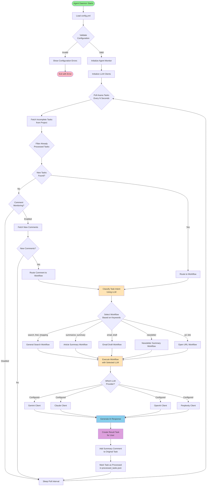
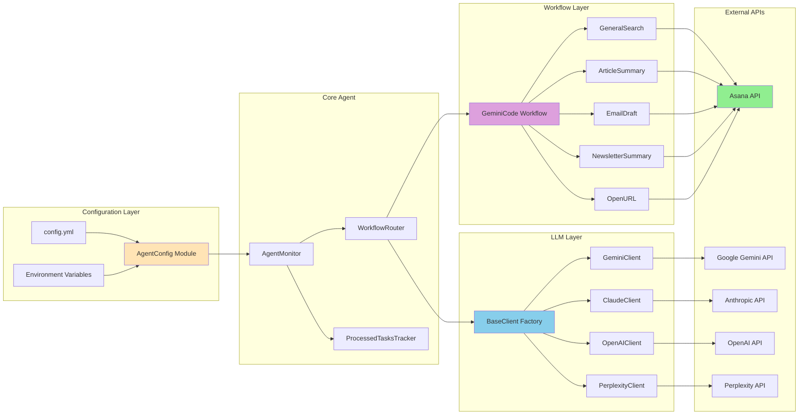
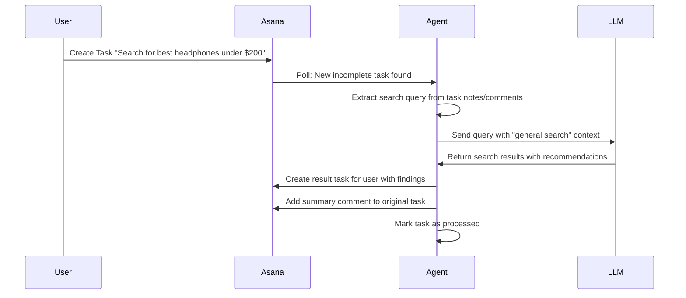
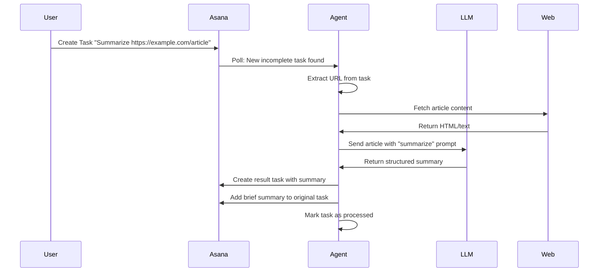
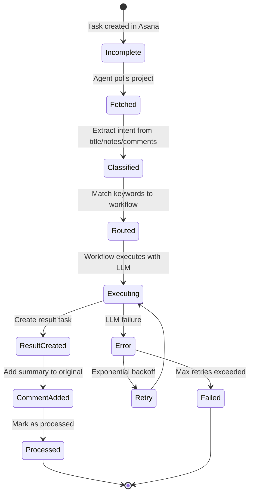

# Asana AI Agent - Architecture Overview

## System Flow Diagram



## Component Architecture



## Workflow Execution Details

### General Search Workflow



### Article Summary Workflow



## Configuration Flow

```mermaid
graph TD
    Start([Start Agent]) --> CheckConfig{config.yml<br/>exists?}
    CheckConfig -->|No| ShowError[Show Error:<br/>Copy config.example.yml]
    CheckConfig -->|Yes| LoadYAML[Load YAML File]

    LoadYAML --> ProcessERB[Process ERB Templates<br/>for ${ENV_VAR} substitution]
    ProcessERB --> ValidateAsana{Validate Asana<br/>Settings}

    ValidateAsana -->|Missing| ShowAsanaError[Error: api_key, workspace_gid,<br/>project_gid required]
    ValidateAsana -->|Valid| ValidateAI{Validate AI<br/>Providers}

    ValidateAI -->|None Enabled| ShowAIError[Error: Enable at least<br/>one AI provider]
    ValidateAI -->|Valid| ValidateKeys{Validate API Keys<br/>for Enabled Providers}

    ValidateKeys -->|Missing| ShowKeyError[Error: API key required<br/>for enabled provider]
    ValidateKeys -->|Valid| ConfigReady[Configuration Ready]

    ShowError --> Exit([Exit])
    ShowAsanaError --> Exit
    ShowAIError --> Exit
    ShowKeyError --> Exit

    ConfigReady --> InitAgent[Initialize Agent Monitor]

    style Start fill:#90EE90
    style ConfigReady fill:#90EE90
    style Exit fill:#FFB6C1
```

## LLM Provider Selection

The agent supports multiple LLM providers with automatic fallback:

1. **Primary Provider**: First enabled provider in `config.yml` (order: Gemini, Claude, OpenAI, Perplexity)
2. **Fallback Logic**: If primary fails, tries next enabled provider
3. **Rate Limiting**: Built-in exponential backoff for rate limit errors
4. **Token Tracking**: Monitors token usage across all providers

## Task Processing Pipeline



## File Structure

```
asana-agent-monitor-oss/
├── config/
│   ├── config.yml                  # User configuration (gitignored)
│   ├── config.example.yml          # Configuration template
│   └── agent_config.rb             # Config loader & validator
├── lib/
│   ├── agent_monitor.rb            # Core agent logic
│   ├── workflow_router.rb          # Routes tasks to workflows
│   ├── processed_tasks_tracker.rb  # Prevents duplicate processing
│   ├── llm/
│   │   ├── base_client.rb          # Factory & base class
│   │   ├── gemini_client.rb        # Google Gemini integration
│   │   ├── claude_client.rb        # Anthropic Claude integration
│   │   ├── openai_client.rb        # OpenAI ChatGPT integration
│   │   └── perplexity_client.rb    # Perplexity AI integration
│   └── workflows/
│       ├── base.rb                 # Base workflow class
│       ├── gemini_code.rb          # Main workflow classifier
│       ├── general_search.rb       # Search & shopping queries
│       ├── article_summary.rb      # Article/content summarization
│       ├── email_draft.rb          # Email drafting
│       ├── newsletter_summary.rb   # Newsletter processing
│       └── open_url.rb             # URL opening
├── bin/
│   └── asana_agent                 # Executable daemon
├── docs/
│   ├── ARCHITECTURE.md             # This file
│   └── QUICKSTART.md               # Setup guide
└── README.md                       # Project overview
```

## Extension Points

### Adding a New Workflow

1. Create `lib/workflows/my_workflow.rb`:
```ruby
module Workflows
  class MyWorkflow < Base
    def execute
      # Your logic here
      create_result_task("Result content")
      add_comment_to_task("Summary")
    end
  end
end
```

2. Add keyword mapping in `config.yml`:
```yaml
workflows:
  keywords:
    my_workflow:
      - keyword1
      - keyword2
```

3. Update `lib/workflows/gemini_code.rb` to route to your workflow

### Adding a New LLM Provider

1. Create `lib/llm/myprovider_client.rb`:
```ruby
module LLM
  class MyProviderClient < ClientBase
    def generate(prompt, options = {})
      # Call your provider's API
      # Return { response: "...", tokens: {...} }
    end
  end
end
```

2. Register in `lib/llm/base_client.rb`:
```ruby
PROVIDERS = {
  'myprovider' => MyProviderClient,
  # ...
}
```

3. Add to `config.example.yml`:
```yaml
ai:
  myprovider:
    enabled: true
    api_key: ${MY_PROVIDER_API_KEY}
```

## Security Considerations

- **API Keys**: Never commit `config.yml` (use environment variables with `${VAR}` syntax)
- **Task Processing**: Each task is processed only once (tracked in `processed_tasks.json`)
- **Comment Monitoring**: Optional - can be disabled to reduce API calls
- **Rate Limiting**: Built-in exponential backoff prevents API abuse
- **Error Handling**: All external API calls wrapped in try/catch with logging

## Performance Optimization

- **Polling Interval**: Configurable (default: 60 seconds)
- **Max Tasks per Cycle**: Limit processing to prevent overload (default: 10)
- **Concurrent Requests**: LLM clients use connection pooling
- **Caching**: Processed tasks cached to avoid redundant API calls
